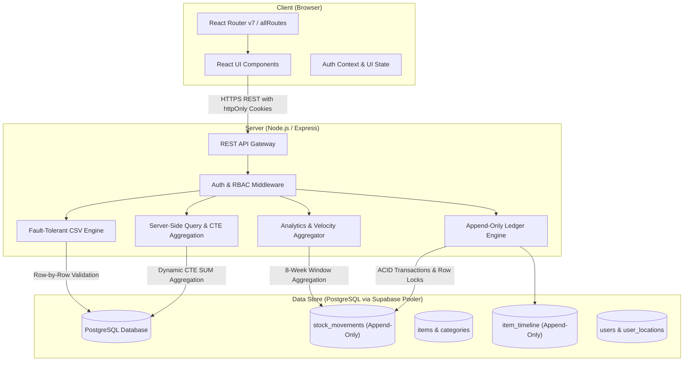

# Architecture

## What are the moving pieces, and how do they talk to each other?

The system is structured as a decoupled client-server architecture centered around an append-only relational stock ledger:

1. **Client (Single-Page Application):**
   - Built with React 19, TypeScript, and Vite.
   - Client-side routing powered by `react-router-dom` (v7) with a centralized route module (`client/src/routes/allRoutes.tsx`), enabling deep-linking (`/dashboard`, `/items`, `/movements`, `/locations`, `/import-export`, `/alerts`), browser Back/Forward traversal, and page-refresh tab persistence.
   - Communicates with the backend exclusively via standard HTTP REST API endpoints using JSON payloads with `credentials: 'include'` for automatic `httpOnly` session cookies and `X-Requested-With: StockPulse-Client` for CSRF defense.
   - Features zero third-party chart library dependencies (pure SVG mathematical Donut and 8-week dual-series movement velocity charts), scoped CSS Modules with localized responsive breakpoints down to 320px, and an ErrorBoundary wrapper.

2. **Server (REST API & Business Logic Engine):**
   - Built with Node.js, Express, and TypeScript.
   - Houses the core business domain logic:
     - Authentication & Session Verification using signed, hardened `httpOnly` cookies (`SameSite=Lax`).
     - Role-Based Access Control (RBAC) middleware verifying that managers have global scope while warehouse staff are strictly scoped to their assigned locations (`requireLocationPermission`).
     - Append-Only Stock Movement Engine verifying atomic transfers, preventing negative stock, and validating mandatory adjustment rationale.
     - Server-side query processor utilizing PostgreSQL Common Table Expressions (CTEs) for multi-factor filtering, text search (`ILIKE`), and dynamic sorting by ledger-derived quantities.
     - Fault-tolerant CSV bulk engine with per-row failure reports and partial success.
     - Operational dashboard aggregation pipeline computing headline KPIs, category/location breakdowns, and 8-week movement volume velocity.
     - Centralized error-sanitization middleware (CWE-209 defense) preventing raw database driver leakages.

3. **Data Layer (PostgreSQL & Prisma ORM):**
   - Stores accounts, locations, staff assignments, categories, items, audit timelines, and the immutable stock ledger.
   - Enforces referential integrity through foreign keys, uniqueness constraints (SKU, location codes, category names), and transaction isolation levels (`SERIALIZABLE` / row locking) to prevent race conditions.
   - Connects via Supabase's IPv4 connection pooler to guarantee seamless reachability from IPv4-only cloud runtimes like Render.

---

## Where does each piece run?

- **Client:** Runs in the end-user's web browser as static assets compiled by Vite and hosted on Vercel (`https://inventory-management-assignment-tawny.vercel.app`).
- **Server:** Runs as an Express.js HTTP process on Render (`https://inventory-control-api-6sgy.onrender.com`).
- **Database:** Runs as a managed PostgreSQL instance on Supabase with automated connection pooling (`aws-0-ap-southeast-1.pooler.supabase.com:5432`).

---

## What is the request path for one representative user action, end to end?

### Representative Action: Recording an Inter-Location Stock Transfer
*A warehouse staff member transfers 20 units of "10mm Copper Pipe" from "Warehouse A" to "Retail Floor B".*

1. **Client Submission:**
   - Staff selects the item, destination location, and quantity (20) in the Stock Movement modal on `/movements` and clicks "Confirm Transfer".
   - Client sends `POST /api/movements/transfer` with `{ itemId, sourceLocationId, destinationLocationId, quantity: 20 }`, accompanied by the browser's signed `httpOnly` cookie (`token=<jwt>`) and the anti-CSRF header `X-Requested-With: StockPulse-Client`.

2. **Server Middleware Pipeline:**
   - `requireAuth` parses and verifies the JWT cookie, retrieving the user record and their assigned locations from `user_locations`.
   - `requireLocationPermission` checks if the user is a `MANAGER` or if `sourceLocationId` is in the user's `assignedLocationIds`. If the staff member is not assigned to "Warehouse A", the request immediately terminates with `403 Forbidden`.

3. **Input Validation:**
   - Zod schema validates that `quantity` is a positive integer, `sourceLocationId != destinationLocationId`, and all IDs are valid UUIDs.

4. **Transactional Execution & Concurrency Lock:**
   - Inside a Prisma/PostgreSQL `$transaction`:
     - Evaluates the item's ledger records for the source location with row locks (`SELECT ... FOR UPDATE`).
     - Derives current on-hand stock at "Warehouse A":
       $$\text{Stock}_{\text{Source}} = \sum (\text{Receipts} + \text{Inbound Transfers}) - \sum (\text{Issues} + \text{Outbound Transfers}) \pm \text{Adjustments}$$
     - If $\text{Stock}_{\text{Source}} < 20$, the server aborts the transaction and returns `400 Bad Request` ("Insufficient stock at source location").
     - If valid, inserts an append-only row into `stock_movements` with `type = 'TRANSFER'`, `quantity = 20`, `sourceLocationId`, `destinationLocationId`, and `userId`.

5. **Response & Client Update:**
   - Server commits the transaction and responds with `201 Created` and the created ledger entry.
   - Client receives the confirmation, updates the ledger stream in real time, and refreshes the low-stock badge counter.

---

## What did you decide *not* to build, and why?

1. **Direct `on_hand` Column in the `items` Table:**
   - *Decision:* Rejected storing a cached `quantity_on_hand` counter in `items` that gets incremented/decremented.
   - *Why:* Storing a mutable balance invites drift and synchronization bugs during concurrent writes or server crashes. Requirement 4 explicitly mandates that on-hand quantity is **never** stored or edited directly, but always derived from the append-only ledger entries.
2. **Third-Party Charting Library Bloat (Recharts / Chart.js):**
   - *Decision:* Implemented custom pure SVG visualizations (Category Donut with `stroke-dasharray` and dual-series 8-week movement bars) instead of pulling in libraries like Recharts or Chart.js.
   - *Why:* Third-party charting libraries add 300kB+ of bloated JavaScript runtime and fragile DOM wrappers. Pure SVG renders instantly, scales responsively with vector precision down to 320px, and has zero runtime dependencies.
3. **WebSockets for Real-time Streaming:**
   - *Decision:* Used standard HTTP REST requests with targeted query refetching and client-side router navigation instead of persistent WebSocket connections.
   - *Why:* Stock movements in warehouse scenarios occur on discrete user transactions (receiving, picking, transferring). WebSockets would add stateful connection overhead on serverless/cloud platforms without tangible benefit over clean REST polling and router state.
4. **Complex Multi-Step Wizard for Movements:**
   - *Decision:* Built unified, rapid-entry movement modals instead of multi-page wizards.
   - *Why:* Warehouse operators prioritize speed of entry. Single-view contextual dialogs with keyboard-friendly inputs minimize operational friction.
